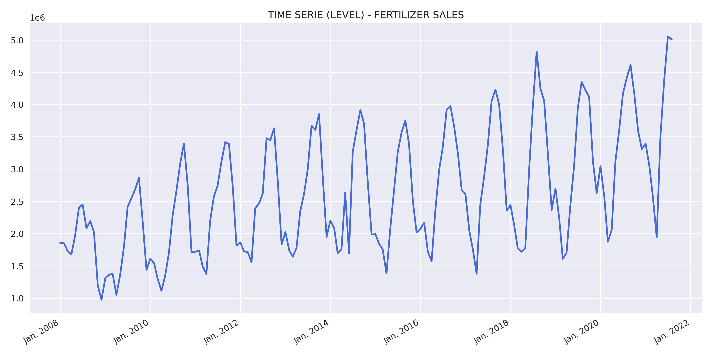
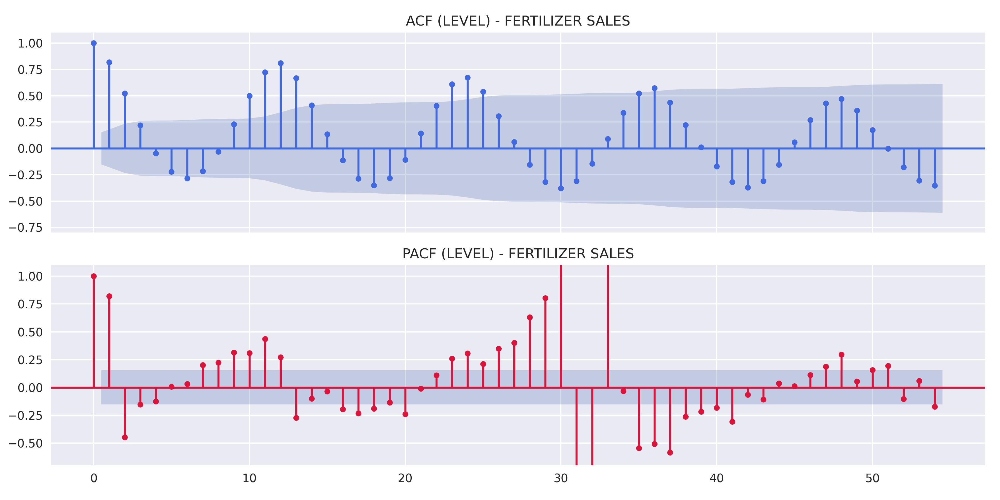
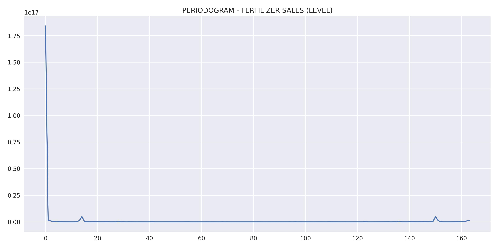
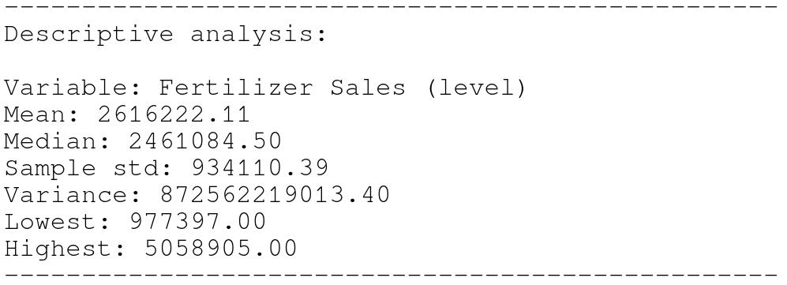
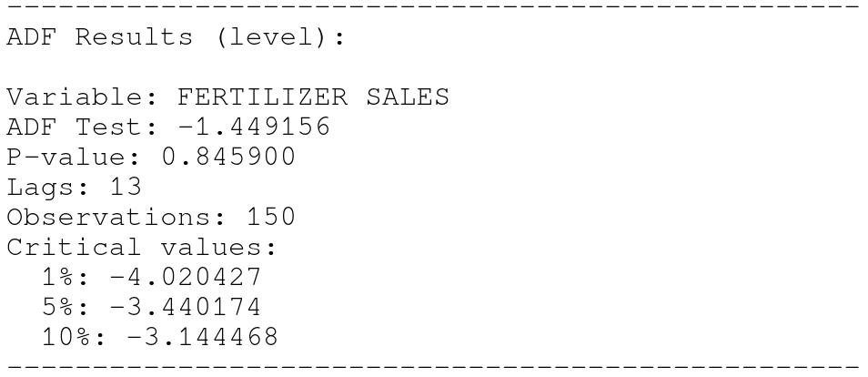
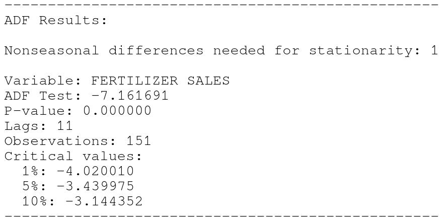
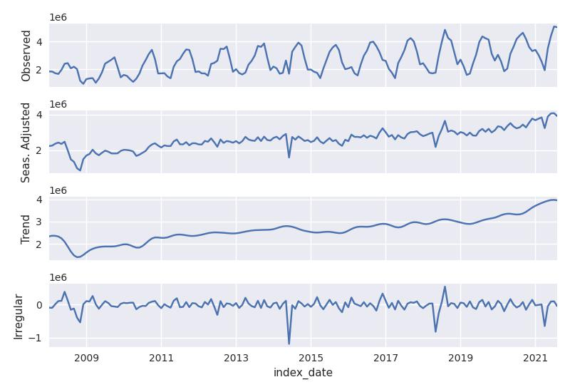
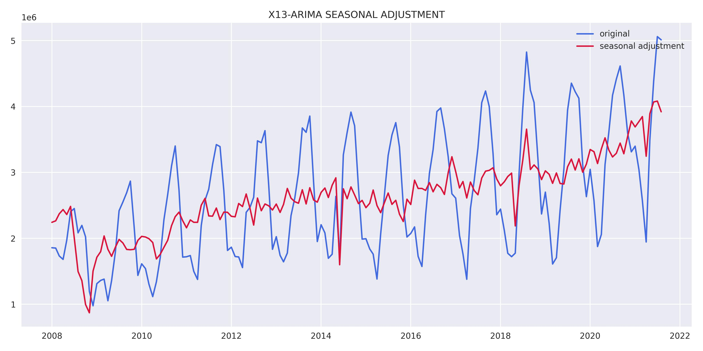
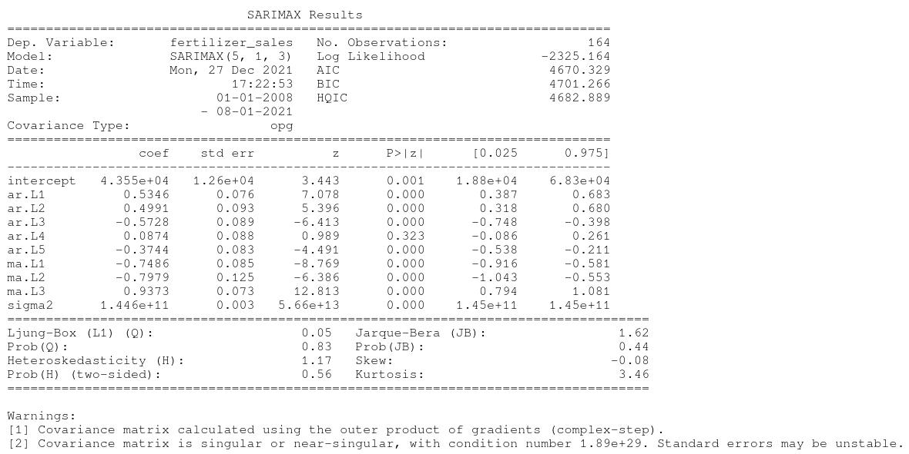

# **DESCRIPTION**
The forecast, which uses temporal series, refers to the data of intermediate fertilizers delivered to the final consumer in this chain. For intermediate fertilizers, those used in NPK mixtures (Nitrogen, Phosphorus and Potassium) or in direct application to the soil are considered to be of the simple type.

Source: http://www.anda.org.br/

# **RESULTS**
Results obtained through the model estimation process.

## Variable analysis at level:
    

    

    

    

## Study of data stationarity:
    

    

## X13-ARIMA-SEATS RESULTS:
    

    

## Model results:
    

## Residual analysis:
    

    

    

## Forecast:
    
